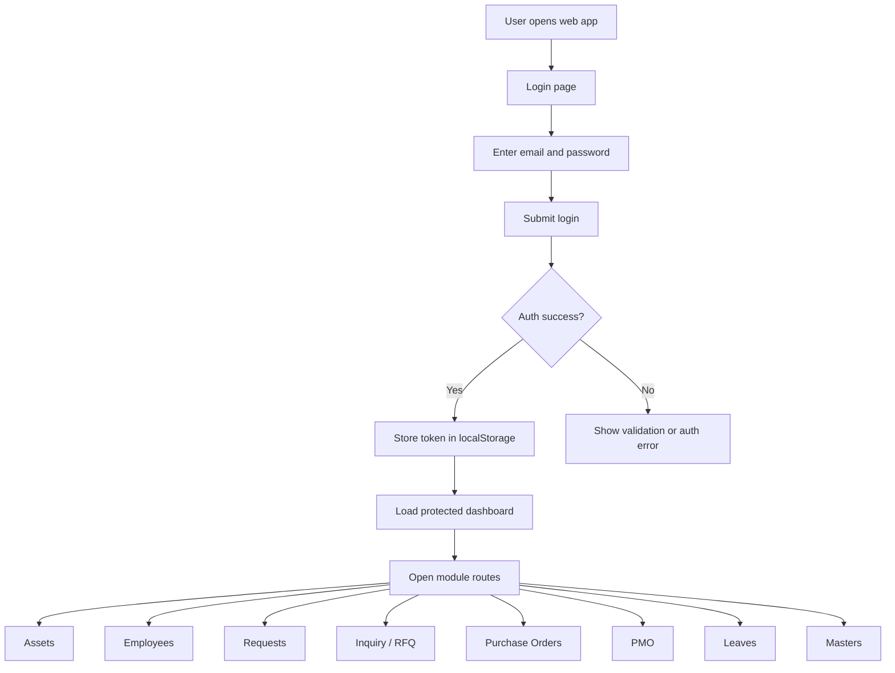

# Web Data Flow

## End-To-End Flow

## Data Movement Summary

1. The browser opens the login route.
2. The user submits credentials from the login form.
3. Successful authentication stores a token in `localStorage`.
4. The app redirects to the protected dashboard.
5. Dashboard and protected module routes are loaded from the authenticated session.
6. Route smoke checks validate that modules open without bouncing back to login.
7. For invalid input, the UI stays on the login surface and shows an error or validation message.

## Test Data Used In The Current Suite

- Admin credentials for privileged route checks
- Employee credentials for role-based login checks
- Invalid email format for validation checks
- Wrong password for authentication failure checks

## Notes

- The current suite is intentionally smoke-level and safe.
- High-risk flows that modify live data should be run only on a staging environment with controlled test records.

